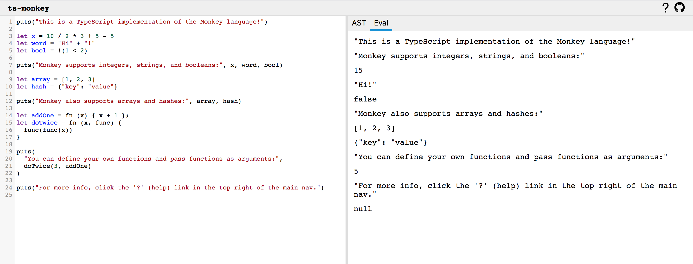

# ts-monkey

A TypeScript implementation of the [monkey language](https://monkeylang.org/) along with an in-browser editor, interpreter, and AST explorer.



For details on the Monkey language see the [unofficial docs](docs/language.md) in this repo or [monkeylang.org](https://monkeylang.org/).

## Structure

Currently, all files (for both the in-browser editor and core language) live in this project. This is for ease while building out the basic feature-set for the editor and language.

This project uses [Next.js](https://nextjs.org/). Source code for the Monkey interpreter lives in `language/` and the rest of the files are organized as a standard [Next.js application](https://nextjs.org/docs/getting-started).

Eventually the core language (source code for the Monkey interpreter) will most likely be moved into its own package.

## Developing

To install dependncies:

```
$ yarn install
```

To start the dev server:

```
$ yarn dev
```

To run tests in watch mode:

```
$ yarn test
```

## Credits

- [Writing an Interpreter in Go](https://interpreterbook.com/): the book and Go implementation that the `ts-monkey` interpreter is based on
- [AST Explorer](https://astexplorer.net/): a web tool for exploring ASTs that inspired the `ts-monkey` UI
